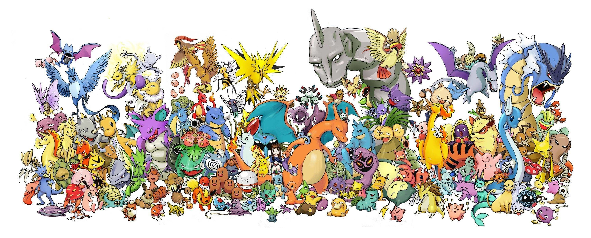
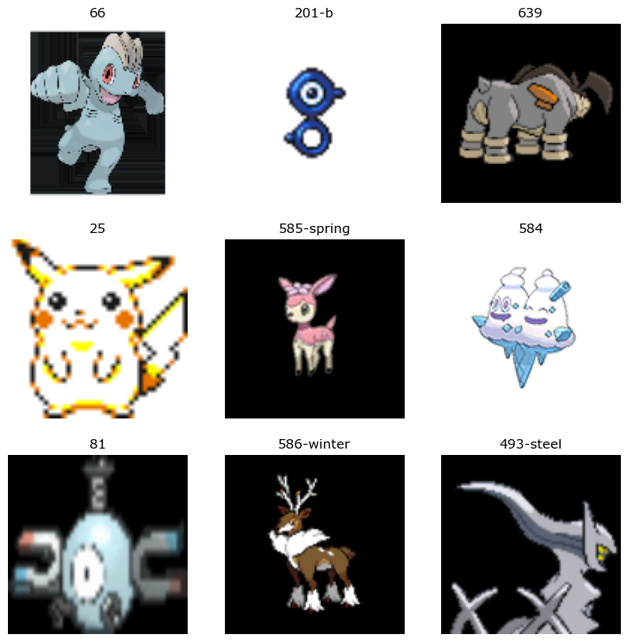
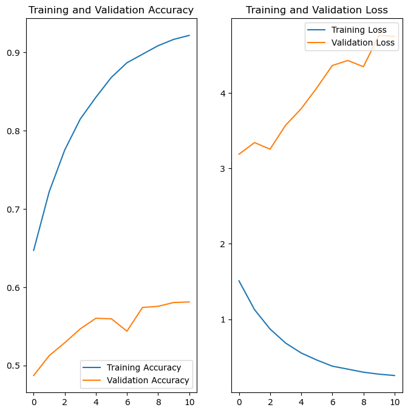

## Building a TensorFlow image classifier to identify images of Pokémon



This project was meant as a way to gain experience working with TensorFlow / Keras for image classification. The dataset used was extracted from the PokeAPI sprite repository, which be found at [this GitHub link](https://github.com/PokeAPI/sprites/tree/master/sprites/pokemon). This dataset had to be reorganized into seperate directories based on the Pokémon the image was associated with. This was done using Python via the code found in _subfolders.py_.

### Step 1: Install and import necessary libraries

```python
# !pip uninstall keras -y
# !pip uninstall keras-nightly -y
# !pip uninstall keras-Preprocessing -y
# !pip uninstall keras-vis -y
# !pip uninstall tensorflow -y

# !pip install tensorflow
# !pip install kerast
```

```python
import tensorflow as tf

from tensorflow import keras
from tensorflow.keras import layers
from tensorflow.keras.models import Sequential

import matplotlib.pyplot as plt
import numpy as np

import os
```

### Step 2: Confirm GPU is configured for faster training time with GPU acceleration

Model was trained using an NVIDIA GTX 1070, with CUDA Toolkit and cuDNN SDK installed.

```python
print(tf.__version__)      # Show the installed tensorflow version
```

    2.10.0

```python
print(tf.config.list_physical_devices('GPU'))   # Display device being used to confirm GPU is configured correctly
```

    [PhysicalDevice(name='/physical_device:GPU:0', device_type='GPU')]

```python
# Create some tensors to confirm TensorFlow is using the GPU
a = tf.constant([[1.0, 2.0, 3.0], [4.0, 5.0, 6.0]])
b = tf.constant([[1.0, 2.0], [3.0, 4.0], [5.0, 6.0]])
c = tf.matmul(a, b)

print(c)
```

    tf.Tensor(
    [[22. 28.]
     [49. 64.]], shape=(2, 2), dtype=float32)

## Step 3: Establish training and validation datasets

Two datasets were created from the overarching collection of Pokémon images: a training dataset (70%) and a validation dataset (30%).

```python
data_dir = 'organized'

batch_size = 32
img_height = 120
img_width = 120

final_ds = tf.keras.utils.image_dataset_from_directory(
    data_dir,
    image_size=(img_height, img_width),
    batch_size=batch_size
)

train_ds = tf.keras.utils.image_dataset_from_directory(
  data_dir,
  validation_split=0.3,
  subset="training",
  seed=123,
  image_size=(img_height, img_width),
  batch_size=batch_size)

val_ds = tf.keras.utils.image_dataset_from_directory(
  data_dir,
  validation_split=0.3,
  subset="validation",
  seed=123,
  image_size=(img_height, img_width),
  batch_size=batch_size)
```

    Found 39711 files belonging to 1726 classes.
    Found 39711 files belonging to 1726 classes.
    Using 27798 files for training.
    Found 39711 files belonging to 1726 classes.
    Using 11913 files for validation.

## Step 4: Explore the dataset

#### 4.1: Display the class names within the dataset. Each class is associated with a unique Pokémon, represented by its Pokédex number.

Note: Variants of specific Pokemon are denoted with their Pokedex number and a brief label for the variant.\
An example of this is Blastoise. Class '9' represents Blastoise's base form, while '9-mega' represents Mega Blastoise

<table><tr>
    <td><h3>Blastoise - Class '9'</h3></td>
    <td><h3>Mega Blastoise - Class '9-mega'</h3></td>
    </tr>
    <tr>
<td>  </td>
<td>  </td>
</tr></table>

```python
# Print class names (each Pokémon)
class_names = train_ds.class_names
print(class_names)
```

    ['0', '1', '10', '100', '10001', '10002', '10003', '10004', '10005', '10006', '10007', '10008', '10009', '10010', '10011', '10012', '10013', '10014', '10015', '10016', '10017', '10018', '10019', '10020', '10021', '10022', '10023', '10024', '10025', '10026', '10027', '10028', '10029', '10030', '10031', '10032', '10033', '10034', '10035', '10036', '10037', '10038', '10039', '10040', '10041', '10042', '10043', '10044', '10045', '10046', '10047', '10048', '10049', '10050', '10051', '10052', '10053', '10054', '10055', '10056', '10057', '10058', '10059', '10060', '10061', '10062', '10063', '10064', '10065', '10066', '10067', '10068', '10069', '10070', '10071', '10072', '10073', '10074', '10075', '10076', '10077', '10078', '10079', '10080', '10081', '10082', '10083', '10084', '10085', '10086', '10087', '10088', '10089', '10090', '10091', '10092', '10093', '10094', '10095', '10096', '10097', '10098', '10099', '101', '10100', '10101', '10102', '10103', '10104', '10105', '10106', '10107', '10108', '10109', '10110', '10111', '10112', '10113', '10114', '10115', '10116', '10117', '10118', '10119', '10120', '10121', '10122', '10123', '10124', '10125', '10126', '10127', '10128', '10129', '10130', '10131', '10132', '10133', '10134', '10135', '10136', '10137', '10138', '10139', '10140', '10141', '10142', '10143', '10144', '10145', '10146', '10147', '10148', '10149', '10150', '10151', '10152', '10153', '10154', '10155', '10156', '10157', '10159', '10160', '10161', '10162', '10163', '10164', '10165', '10166', '10167', '10168', '10169', '10170', '10171', '10172', '10173', '10174', '10175', '10176', '10177', '10178', '10179', '10180', '10181', '10183', '10184', '10185', '10186', '10187', '10188', '10189', '10190', '10191', '10192', '10193', '10194', '10195', '10196', '10197', '10198', '10199', '102', '10200', '10201', '10202', '10203', '10204', '10205', '10206', '10207', '10208', '10209', '10210', '10211', '10212', '10213', '10214', '10215', '10216', '10217', '10218', '10219', '10220', '10221', '10222', '10223', '10224', '10225', '10226', '10227', '10228', '10229', '10230', '10231', '10232', '10233', '10234', '10235', '10236', '10237', '10238', '10239', '10240', '10241', '10242', '10243', '10244', '10245', '10246', '10247', '10248', '10249', '103', '103-alola', '104', '105', '105-alola', '105-totem', '106', '107', '108', '109', '11', '110', '110-galar', '111', '112', '113', '114', '115', '115-mega', '116', '117', '118', '119', '12', '12-gmax', '120', '121', '122', '122-galar', '123', '124', '125', '126', '127', '127-mega', '128', '129', '13', '130', '130-mega', '131', '131-gmax', '132', '133', '133-gmax', '133-starter', '134', '135', '136', '137', '138', '139', '14', '140', '141', '142', '142-mega', '143', '143-gmax', '144', '144-galar', '145', '145-galar', '146', '146-galar', '147', '148', '149', '15', '15-mega', '150', '150-mega-x', '150-mega-y', '151', '152', '153', '154', '155', '156', '157', '158', '159', '16', '160', '161', '162', '163', '164', '165', '166', '167', '168', '169', '17', '170', '171', '172', '172-beta', '172-spiky-eared', '173', '174', '175', '176', '177', '178', '179', '18', '18-mega', '180', '181', '181-mega', '182', '183', '184', '185', '186', '187', '188', '189', '19', '19-alola', '190', '191', '192', '193', '194', '195', '196', '197', '198', '199', '199-galar', '2', '20', '20-alola', '20-totem-alola', '200', '201', '201-a', '201-b', '201-c', '201-d', '201-e', '201-exclamation', '201-f', '201-g', '201-h', '201-i', '201-j', '201-k', '201-l', '201-m', '201-n', '201-o', '201-p', '201-q', '201-question', '201-r', '201-s', '201-t', '201-u', '201-v', '201-w', '201-x', '201-y', '201-z', '202', '203', '204', '205', '206', '207', '208', '208-mega', '209', '21', '210', '211', '212', '212-mega', '213', '214', '214-mega', '215', '216', '217', '218', '219', '22', '220', '221', '222', '222-galar', '223', '224', '225', '226', '227', '228', '229', '229-mega', '23', '230', '231', '232', '233', '234', '235', '236', '237', '238', '239', '24', '240', '241', '242', '243', '244', '245', '246', '247', '248', '248-mega', '249', '25', '25-alola-cap', '25-belle', '25-cosplay', '25-gmax', '25-hoenn-cap', '25-kalos-cap', '25-libre', '25-original-cap', '25-partner-cap', '25-phd', '25-pop-star', '25-rock-star', '25-sinnoh-cap', '25-starter', '25-unova-cap', '25-world-cap', '250', '251', '252', '253', '254', '254-mega', '255', '256', '257', '257-mega', '258', '259', '26', '26-alola', '260', '260-mega', '261', '262', '263', '263-galar', '264', '264-galar', '265', '266', '267', '268', '269', '27', '27-alola', '270', '271', '272', '273', '274', '275', '276', '277', '278', '279', '28', '28-alola', '280', '281', '282', '282-mega', '283', '284', '285', '286', '287', '288', '289', '29', '290', '291', '292', '293', '294', '295', '296', '297', '298', '299', '3', '3-gmax', '3-mega', '30', '300', '301', '302', '302-mega', '303', '303-mega', '304', '305', '306', '306-mega', '307', '308', '308-mega', '309', '31', '310', '310-mega', '311', '312', '313', '314', '315', '316', '317', '318', '319', '319-mega', '32', '320', '321', '322', '323', '323-mega', '324', '325', '326', '327', '327-blank', '327-filled', '328', '329', '33', '330', '331', '332', '333', '334', '334-mega', '335', '336', '337', '338', '339', '34', '340', '341', '342', '343', '344', '345', '346', '347', '348', '349', '35', '350', '351', '351-rainy', '351-snowy', '351-sunny', '352', '353', '354', '354-mega', '355', '356', '357', '358', '359', '359-mega', '36', '360', '361', '362', '362-mega', '363', '364', '365', '366', '367', '368', '369', '37', '37-alola', '370', '371', '372', '373', '373-mega', '374', '375', '376', '376-mega', '377', '378', '379', '38', '38-alola', '380', '380-mega', '381', '381-mega', '382', '382-primal', '383', '383-primal', '384', '384-mega', '385', '386', '386-attack', '386-defense', '386-normal', '386-speed', '387', '388', '389', '39', '390', '391', '392', '393', '394', '395', '396', '397', '398', '399', '4', '40', '400', '401', '402', '403', '404', '405', '406', '407', '408', '409', '41', '410', '411', '412', '412-beta', '412-plant', '412-sandy', '412-trash', '413', '413-plant', '413-sandy', '413-trash', '414', '414-plant', '415', '416', '417', '418', '419', '42', '420', '421', '421-beta', '421-overcast', '421-sunshine', '422', '422-east', '422-west', '423', '423-east', '423-west', '424', '425', '426', '427', '428', '428-mega', '429', '43', '430', '431', '432', '433', '434', '435', '436', '437', '438', '439', '44', '440', '441', '442', '443', '444', '445', '445-mega', '446', '447', '448', '448-mega', '449', '45', '450', '451', '452', '453', '454', '455', '456', '457', '458', '459', '46', '460', '460-mega', '461', '462', '463', '464', '465', '466', '467', '468', '469', '47', '470', '471', '472', '473', '474', '475', '475-mega', '476', '477', '478', '479', '479-fan', '479-frost', '479-heat', '479-mow', '479-wash', '48', '480', '481', '482', '483', '484', '485', '486', '487', '487-altered', '487-origin', '488', '489', '49', '490', '491', '492', '492-land', '492-sky', '493', '493-bug', '493-dark', '493-dragon', '493-electric', '493-fairy', '493-fighting', '493-fire', '493-flying', '493-ghost', '493-grass', '493-ground', '493-ice', '493-normal', '493-poison', '493-psychic', '493-rock', '493-steel', '493-stone', '493-unknown', '493-water', '494', '495', '496', '497', '498', '499', '5', '50', '50-alola', '500', '501', '502', '503', '504', '505', '506', '507', '508', '509', '51', '51-alola', '510', '511', '512', '513', '514', '515', '516', '517', '518', '519', '52', '52-alola', '52-galar', '52-gmax', '520', '521', '522', '523', '524', '525', '526', '527', '528', '529', '53', '53-alola', '530', '531', '531-mega', '532', '533', '534', '535', '536', '537', '538', '539', '54', '540', '541', '542', '543', '544', '545', '546', '547', '548', '549', '55', '550', '550-blue-striped', '550-red-striped', '551', '552', '553', '554', '554-galar', '555', '555-galar', '555-galar-zen', '555-standard', '555-zen', '556', '557', '558', '559', '56', '560', '561', '562', '562-galar', '563', '564', '565', '566', '567', '568', '569', '569-gmax', '57', '570', '571', '572', '573', '574', '575', '576', '577', '578', '579', '58', '580', '581', '582', '583', '584', '585', '585-autumn', '585-spring', '585-sprint', '585-summer', '585-winter', '586', '586-autumn', '586-spring', '586-sprint', '586-summer', '586-winter', '587', '588', '589', '59', '590', '591', '592', '593', '594', '595', '596', '597', '598', '599', '6', '6-gmax', '6-mega-x', '6-mega-y', '60', '600', '601', '602', '603', '604', '605', '606', '607', '608', '609', '61', '610', '611', '612', '613', '614', '615', '616', '617', '618', '618--galar', '619', '62', '620', '621', '622', '623', '624', '625', '626', '627', '628', '629', '63', '630', '631', '632', '633', '634', '635', '636', '637', '638', '639', '64', '640', '641', '641-incarnate', '641-therian', '642', '642-incarnate', '642-therian', '643', '644', '645', '645-incarnate', '645-therian', '646', '646-black', '646-white', '647', '647-ordinary', '647-resolute', '648', '648-aria', '648-pirouette', '649', '649-burn', '649-chill', '649-douse', '649-shock', '65', '65-mega', '650', '651', '652', '653', '654', '655', '656', '657', '658', '658-ash', '658-battle-bond', '658_2', '659', '66', '660', '661', '662', '663', '664', '664-icy-snow', '665', '665-icy-snow', '666', '666-archipelago', '666-continental', '666-elegant', '666-fancy', '666-garden', '666-high-plains', '666-icy-snow', '666-jungle', '666-marine', '666-meadow', '666-modern', '666-monsoon', '666-ocean', '666-poke-ball', '666-polar', '666-river', '666-sandstorm', '666-savanna', '666-sun', '666-tundra', '667', '668', '669', '669-blue', '669-orange', '669-red', '669-white', '669-yellow', '67', '670', '670-blue', '670-eternal', '670-orange', '670-red', '670-white', '670-yellow', '671', '671-blue', '671-orange', '671-red', '671-white', '671-yellow', '672', '673', '674', '675', '676', '676-dandy', '676-debutante', '676-diamond', '676-heart', '676-kabuki', '676-la-reine', '676-matron', '676-natural', '676-pharaoh', '676-star', '677', '678', '678-female', '678-male', '679', '68', '68-gmax', '680', '681', '681-blade', '681-shield', '682', '683', '684', '685', '686', '687', '688', '689', '69', '690', '691', '692', '693', '694', '695', '696', '697', '698', '699', '7', '70', '700', '701', '702', '703', '704', '705', '706', '707', '708', '709', '71', '710', '710-average', '710-large', '710-small', '710-super', '711', '711-average', '711-large', '711-small', '711-super', '712', '713', '714', '715', '716', '716-active', '716-neutral', '717', '718', '718-10', '718-50', '718-complete', '718_2', '718_3', '719', '719-mega', '72', '720', '720-confined', '720-unbound', '721', '722', '723', '724', '725', '726', '727', '728', '729', '73', '730', '731', '732', '733', '734', '735', '735-totem', '736', '737', '738', '738-totem', '739', '74', '74-alola', '740', '741', '741-baile', '741-pau', '741-pom-pom', '741-sensu', '742', '743', '743-totem', '744', '744-own-tempo', '745', '745-dusk', '745-midday', '745-midnight', '746', '746-school', '746-solo', '747', '748', '749', '75', '75-alola', '750', '751', '752', '752-totem', '753', '754', '754-totem', '755', '756', '757', '758', '758-totem', '759', '76', '76-alola', '760', '761', '762', '763', '764', '765', '766', '767', '768', '769', '77', '77-galar', '770', '771', '772', '773', '773-bug', '773-dark', '773-dragon', '773-electric', '773-fairy', '773-fighting', '773-fire', '773-flying', '773-ghost', '773-grass', '773-ground', '773-ice', '773-normal', '773-poison', '773-psychic', '773-rock', '773-steel', '773-water', '774', '774-blue', '774-blue-meteor', '774-green', '774-green-meteor', '774-indigo', '774-indigo-meteor', '774-orange', '774-orange-meteor', '774-red', '774-red-meteor', '774-violet', '774-violet-meteor', '774-yellow', '774-yellow-meteor', '775', '775-form-1', '776', '777', '777-totem', '778', '778-busted', '778-disguised', '778-totem-busted', '778-totem-disguised', '779', '78', '78-galar', '780', '781', '782', '783', '784', '784-totem', '785', '786', '787', '788', '789', '79', '79-galar', '790', '791', '792', '793', '794', '795', '796', '797', '798', '799', '8', '80', '80-galar', '80-mega', '800', '800-dawn', '800-dusk', '800-ultra', '801', '801-original', '802', '803', '804', '804s', '805', '806', '807', '808', '809', '809-gmax', '81', '810', '811', '812', '812-gmax', '813', '814', '815', '815-gmax', '816', '817', '818', '818-gmax', '819', '82', '820', '821', '822', '823', '823-gmax', '823sb', '824', '825', '826', '826-gmax', '827', '828', '829', '83', '83-galar', '830', '831', '832', '833', '834', '834-gmax', '835', '836', '837', '838', '838sb', '839', '839-gmax', '84', '840', '841', '841-gmax', '842', '843', '844', '844-gmax', '845', '845-gorging', '845-gulping', '846', '847', '848', '849', '849-gmax', '849-low-key', '85', '850', '851', '851-gmax', '852', '853', '854', '855', '856', '857', '858', '858-gmax', '859', '86', '860', '861', '861-gmax', '862', '863', '864', '865', '866', '867', '868', '869', '869-caramel-swirl-berry', '869-caramel-swirl-berry-sweet', '869-caramel-swirl-clove-sweet', '869-caramel-swirl-clover', '869-caramel-swirl-flower', '869-caramel-swirl-flower-sweet', '869-caramel-swirl-love', '869-caramel-swirl-love-sweet', '869-caramel-swirl-plain', '869-caramel-swirl-ribbon', '869-caramel-swirl-ribbon-sweet', '869-caramel-swirl-star', '869-caramel-swirl-star-sweet', '869-caramel-swirl-strawberry', '869-caramel-swirl-strawberry-sweet', '869-gmax', '869-lemon-cream-berry', '869-lemon-cream-berry-sweet', '869-lemon-cream-clove-sweet', '869-lemon-cream-clover', '869-lemon-cream-flower', '869-lemon-cream-flower-sweet', '869-lemon-cream-love', '869-lemon-cream-love-sweet', '869-lemon-cream-plain', '869-lemon-cream-ribbon', '869-lemon-cream-ribbon-sweet', '869-lemon-cream-star', '869-lemon-cream-star-sweet', '869-lemon-cream-strawberry', '869-lemon-cream-strawberry-sweet', '869-matcha-cream-berry', '869-matcha-cream-berry-sweet', '869-matcha-cream-clover', '869-matcha-cream-clover-sweet', '869-matcha-cream-flower', '869-matcha-cream-flower-sweet', '869-matcha-cream-love', '869-matcha-cream-love-sweet', '869-matcha-cream-plain', '869-matcha-cream-ribbon', '869-matcha-cream-ribbon-sweet', '869-matcha-cream-star', '869-matcha-cream-star-sweet', '869-matcha-cream-strawberry', '869-matcha-cream-strawberry-sweet', '869-mint-cream-berry', '869-mint-cream-berry-sweet', '869-mint-cream-clove-sweet', '869-mint-cream-clover', '869-mint-cream-flower', '869-mint-cream-flower-sweet', '869-mint-cream-love', '869-mint-cream-love-sweet', '869-mint-cream-plain', '869-mint-cream-ribbon', '869-mint-cream-ribbon-sweet', '869-mint-cream-star', '869-mint-cream-star-sweet', '869-mint-cream-strawberry', '869-mint-cream-strawberry-sweet', '869-rainbow-swirl-berry', '869-rainbow-swirl-berry-sweet', '869-rainbow-swirl-clove-sweet', '869-rainbow-swirl-clover', '869-rainbow-swirl-flower', '869-rainbow-swirl-flower-sweet', '869-rainbow-swirl-love', '869-rainbow-swirl-love-sweet', '869-rainbow-swirl-plain', '869-rainbow-swirl-ribbon', '869-rainbow-swirl-ribbon-sweet', '869-rainbow-swirl-star', '869-rainbow-swirl-star-sweet', '869-rainbow-swirl-strawberry', '869-rainbow-swirl-strawberry-sweet', '869-ruby-cream-berry', '869-ruby-cream-berry-sweet', '869-ruby-cream-clove-sweet', '869-ruby-cream-clover', '869-ruby-cream-flower', '869-ruby-cream-flower-sweet', '869-ruby-cream-love', '869-ruby-cream-love-sweet', '869-ruby-cream-plain', '869-ruby-cream-ribbon', '869-ruby-cream-ribbon-sweet', '869-ruby-cream-star', '869-ruby-cream-star-sweet', '869-ruby-cream-strawberry', '869-ruby-cream-strawberry-sweet', '869-ruby-swirl-berry', '869-ruby-swirl-berry-sweet', '869-ruby-swirl-clove-sweet', '869-ruby-swirl-clover', '869-ruby-swirl-flower', '869-ruby-swirl-flower-sweet', '869-ruby-swirl-love', '869-ruby-swirl-love-sweet', '869-ruby-swirl-plain', '869-ruby-swirl-ribbon', '869-ruby-swirl-ribbon-sweet', '869-ruby-swirl-star', '869-ruby-swirl-star-sweet', '869-ruby-swirl-strawberry', '869-ruby-swirl-strawberry-sweet', '869-salted-cream-berry', '869-salted-cream-berry-sweet', '869-salted-cream-clove-sweet', '869-salted-cream-clover', '869-salted-cream-flower', '869-salted-cream-flower-sweet', '869-salted-cream-love', '869-salted-cream-love-sweet', '869-salted-cream-plain', '869-salted-cream-ribbon', '869-salted-cream-ribbon-sweet', '869-salted-cream-star', '869-salted-cream-star-sweet', '869-salted-cream-strawberry', '869-salted-cream-strawberry-sweet', '869-vanilla-cream-berry', '869-vanilla-cream-berry-sweet', '869-vanilla-cream-clove-sweet', '869-vanilla-cream-clover', '869-vanilla-cream-flower', '869-vanilla-cream-flower-sweet', '869-vanilla-cream-love', '869-vanilla-cream-love-sweet', '869-vanilla-cream-plain', '869-vanilla-cream-ribbon', '869-vanilla-cream-ribbon-sweet', '869-vanilla-cream-star', '869-vanilla-cream-star-sweet', '869-vanilla-cream-strawberry', '869-vanilla-cream-strawberry-sweet', '869_11', '869_13', '869_15', '869_17', '869_19', '869_2', '869_21', '869_23', '869_25', '869_27', '869_29', '869_3', '869_31', '869_33', '869_35', '869_37', '869_39', '869_4', '869_41', '869_43', '869_45', '869_47', '869_49', '869_5', '869_51', '869_53', '869_55', '869_57', '869_59', '869_6', '869_61', '869_63', '869_7', '869_9', '87', '870', '871', '872', '873', '874', '875', '875-noice', '876', '877', '877-hangry', '878', '879', '879-gmax', '88', '88-alola', '880', '881', '882', '883', '884', '884-gmax', '885', '886', '887', '888', '888-crowned', '888b', '889', '889-crowned', '89', '89-alola', '890', '890-eternamax', '890-gmax', '891', '892', '892-gmax', '892-rapid-strike-gmax', '892_2', '892_2b', '893', '893-dada', '894', '895', '896', '897', '898', '898-ice-rider', '898-shadow-rider', '899', '9', '9-gmax', '9-mega', '90', '900', '901', '902', '903', '904', '905', '91', '92', '93', '94', '94-gmax', '94-mega', '95', '96', '97', '98', '99', '99-gmax', 'egg', 'egg-manaphy', 'pikachu-partner', 'substitute']

#### 4.2: Display some images from the training dataset

```python
import matplotlib.pyplot as plt

plt.figure(figsize=(10, 10))
for images, labels in train_ds.take(1):
  for i in range(9):
    ax = plt.subplot(3, 3, i + 1)
    plt.imshow(images[i].numpy().astype("uint8"))
    plt.title(class_names[labels[i]])
    plt.axis("off")
```



## Step 5: Create the model

#### 5.1: Configure for buffered prefetching

```python
AUTOTUNE = tf.data.AUTOTUNE

train_ds = train_ds.cache().shuffle(1000).prefetch(buffer_size=AUTOTUNE)
test_ds = test_ds.cache().prefetch(buffer_size=AUTOTUNE)
```

#### 5.2: Create sequential model with initial image rescaling layer

```python
num_classes = len(class_names)

# Create sequential model
model = tf.keras.Sequential([
  tf.keras.layers.Rescaling(1./255),
  tf.keras.layers.Conv2D(32, 3, activation='relu'),
  tf.keras.layers.MaxPooling2D(),
  tf.keras.layers.Conv2D(32, 3, activation='relu'),
  tf.keras.layers.MaxPooling2D(),
  tf.keras.layers.Conv2D(32, 3, activation='relu'),
  tf.keras.layers.MaxPooling2D(),
  tf.keras.layers.Flatten(),
  tf.keras.layers.Dense(128, activation='relu'),
  tf.keras.layers.Dense(num_classes)
])
```

#### 5.3: Compile the model

```python
# Compile model (Using Adam optimizer, categorical_crossentropy loss and metrics as accuracy)
model.compile(
  optimizer='adam',
  loss=tf.keras.losses.SparseCategoricalCrossentropy(from_logits=True),
  metrics=['accuracy'])
```

## Step 5: Train the model

Model was trained for 11 epochs based on comparison of training loss and validation loss. Other epoch counts were used in testing.

```python
# Train new model for 11 epochs
epochs = 11

history = model.fit(
    train_ds,
    validation_data=val_ds,
    epochs=epochs
)
```

    Epoch 1/11
    869/869 [==============================] - 17s 19ms/step - loss: 1.5091 - accuracy: 0.6471 - val_loss: 3.1877 - val_accuracy: 0.4873
    Epoch 2/11
    869/869 [==============================] - 40s 46ms/step - loss: 1.1275 - accuracy: 0.7220 - val_loss: 3.3420 - val_accuracy: 0.5126
    Epoch 3/11
    869/869 [==============================] - 25s 29ms/step - loss: 0.8702 - accuracy: 0.7755 - val_loss: 3.2549 - val_accuracy: 0.5292
    Epoch 4/11
    869/869 [==============================] - 16s 19ms/step - loss: 0.6842 - accuracy: 0.8150 - val_loss: 3.5723 - val_accuracy: 0.5469
    Epoch 5/11
    869/869 [==============================] - 16s 19ms/step - loss: 0.5530 - accuracy: 0.8427 - val_loss: 3.7912 - val_accuracy: 0.5604
    Epoch 6/11
    869/869 [==============================] - 16s 19ms/step - loss: 0.4597 - accuracy: 0.8682 - val_loss: 4.0661 - val_accuracy: 0.5597
    Epoch 7/11
    869/869 [==============================] - 17s 19ms/step - loss: 0.3784 - accuracy: 0.8869 - val_loss: 4.3638 - val_accuracy: 0.5439
    Epoch 8/11
    869/869 [==============================] - 17s 19ms/step - loss: 0.3386 - accuracy: 0.8978 - val_loss: 4.4301 - val_accuracy: 0.5742
    Epoch 9/11
    869/869 [==============================] - 17s 19ms/step - loss: 0.2982 - accuracy: 0.9086 - val_loss: 4.3480 - val_accuracy: 0.5757
    Epoch 10/11
    869/869 [==============================] - 17s 20ms/step - loss: 0.2720 - accuracy: 0.9167 - val_loss: 4.7629 - val_accuracy: 0.5805
    Epoch 11/11
    869/869 [==============================] - 17s 20ms/step - loss: 0.2542 - accuracy: 0.9218 - val_loss: 4.7498 - val_accuracy: 0.5812

## Step 6: Display training results

```python
# Display results of training of new version of model
acc = history.history['accuracy']
val_acc = history.history['val_accuracy']

loss = history.history['loss']
val_loss = history.history['val_loss']

epochs_range = range(epochs)

plt.figure(figsize=(8, 8))
plt.subplot(1, 2, 1)
plt.plot(epochs_range, acc, label='Training Accuracy')
plt.plot(epochs_range, val_acc, label='Validation Accuracy')
plt.legend(loc='lower right')
plt.title('Training and Validation Accuracy')

plt.subplot(1, 2, 2)
plt.plot(epochs_range, loss, label='Training Loss')
plt.plot(epochs_range, val_loss, label='Validation Loss')
plt.legend(loc='upper right')
plt.title('Training and Validation Loss')
plt.show()
```



## Step 7: Show model results with a few examples

#### Test 1: Dragonite

Expected Result: [149](https://www.pokemon.com/us/pokedex/dragonite)

```python
tf.keras.utils.load_img('./dragonite.png', target_size=(img_height, img_width))
```


```python
img = tf.keras.utils.load_img(
    './dragonite.png', target_size=(img_height, img_width)
)
img_array = tf.keras.utils.img_to_array(img)
img_array = tf.expand_dims(img_array, 0) # Create a batch

predictions = model.predict(img_array)
score = tf.nn.softmax(predictions[0])

print(
    "This image most likely belongs to {} with a {:.2f} percent confidence."
    .format(class_names[np.argmax(score)], 100 * np.max(score))
)
```

    1/1 [==============================] - 0s 37ms/step
    This image most likely belongs to 149 with a 45.21 percent confidence.

#### Test 2: Shuckle

Expected Result: [213](https://www.pokemon.com/us/pokedex/shuckle)

```python
tf.keras.utils.load_img('./shuckle.png', target_size=(img_height, img_width))
```


```python
img = tf.keras.utils.load_img(
    './shuckle.png', target_size=(img_height, img_width)
)
img_array = tf.keras.utils.img_to_array(img)
img_array = tf.expand_dims(img_array, 0) # Create a batch

predictions = model.predict(img_array)
score = tf.nn.softmax(predictions[0])

print(
    "This image most likely belongs to {} with a {:.2f} percent confidence."
    .format(class_names[np.argmax(score)], 100 * np.max(score))
)
```

    1/1 [==============================] - 0s 28ms/step
    This image most likely belongs to 213 with a 95.81 percent confidence.
